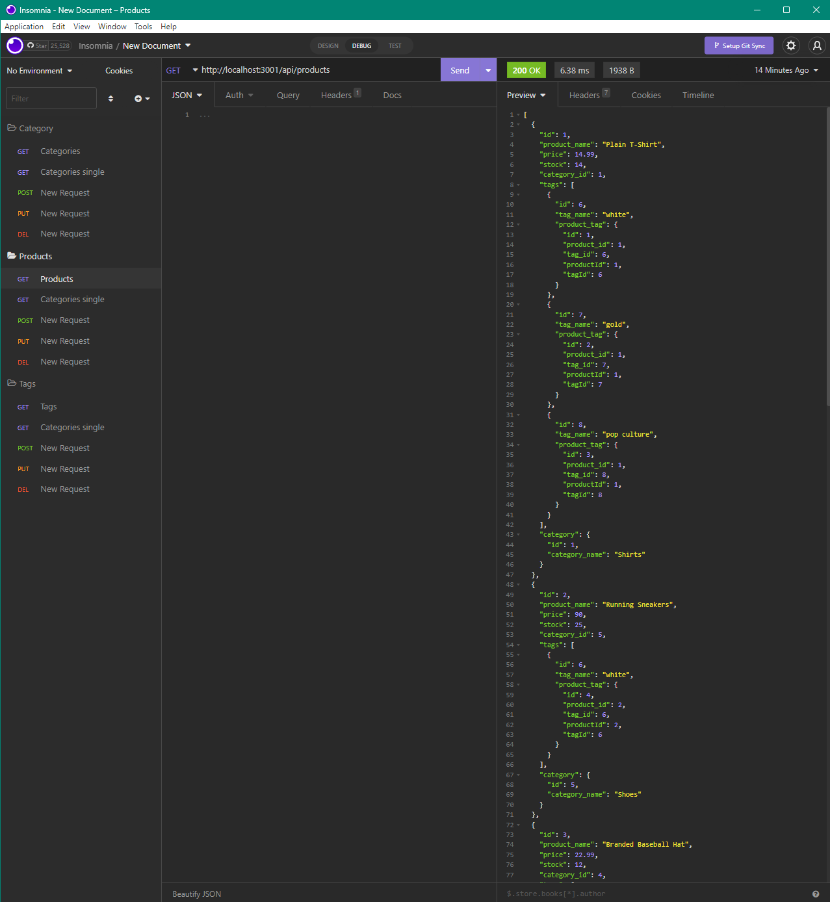

# E-Commerce Backend

## Description

The motivation and purpose behind this project was to create the backend for an e-commerce website. It solves the issue of not having a functioning backend that can be used to update prices and inventory stock. I learned a lot about using proper syntax such as adding missing commas and taking out unused spaces. I also learned a lot about using Insomnia.

## Table of Contents

- [Installation](#installation)
- [Usage](#usage)
- [Credits](#credits)
- [License](#license)

## Installation

MySQL 2, Dotenv, and Sequelize all must be installed

## Usage

Demo video: [here](https://drive.google.com/file/d/1s7t09xt_BaDFMN_O3aGgVly_qZFT5vq9/view)

## Credits

[MySQL 2](https://www.npmjs.com/package/mysql2)

[Dotenv](https://www.npmjs.com/package/dotenv)

[Sequelize](https://www.npmjs.com/package/sequelize)

## License

MIT License

A short and simple permissive license with conditions only requiring preservation of copyright and license notices. Licensed works, modifications, and larger works may be distributed under different terms and without source code.